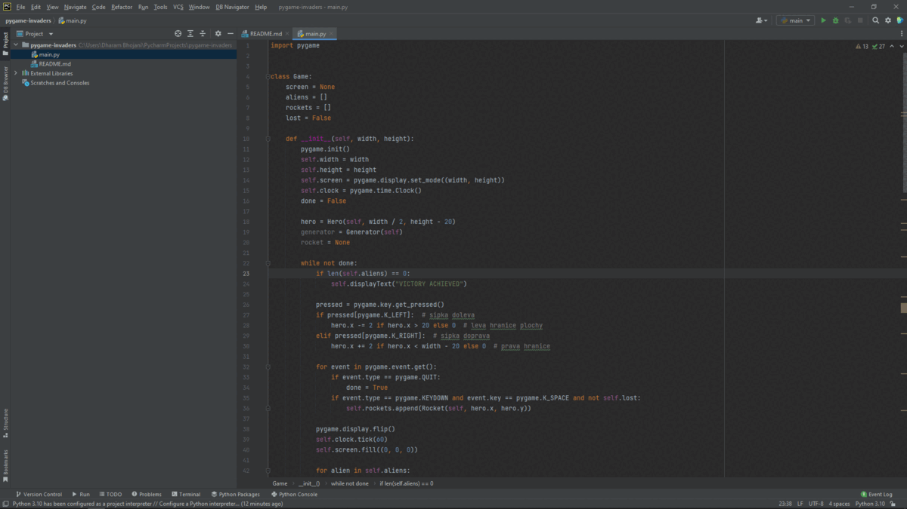

# Pygame Invaders

Here we have made a game using python libraries like **Pygame**.

It is a *Block Clearing game* where the user have to **_break_** the blocks.

1. You need to install Python 3.10.4 from [here](https://www.python.org/downloads/)
2. You need to install Pygame
``` 
pip install pygame
```
2. OR you can use this [Link](https://pypi.org/project/pygame/)
3. And the total Requirements is full filled.

### Important Instructions :

* The User will get one chance by default.
* The blocks comes in a form like a matrix.
* With the help of **Space Bar** the user shoot the bullets to the block bars.
* With the help of Directional keys the User can control the flow of their own Battle Ship.

Reference Code : 
```python

def __init__(self, width, height):
    pygame.init()
    self.width = width
    self.height = height
    self.screen = pygame.display.set_mode((width, height))
    self.clock = pygame.time.Clock()
    done = False
    hero = Hero(self, width / 2, height - 20)
    generator = Generator(self)
    rocket = None
```
Reference Images : <br>
	<br>
	
This is the README file for Pygame Invaders repository. [^1]

[^1]: By : Dharam Bhojani.
